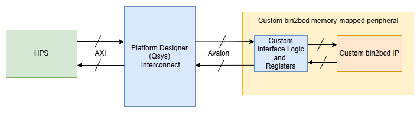
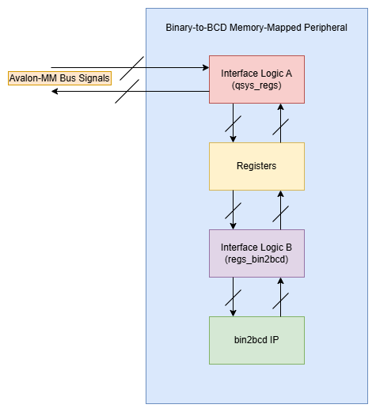
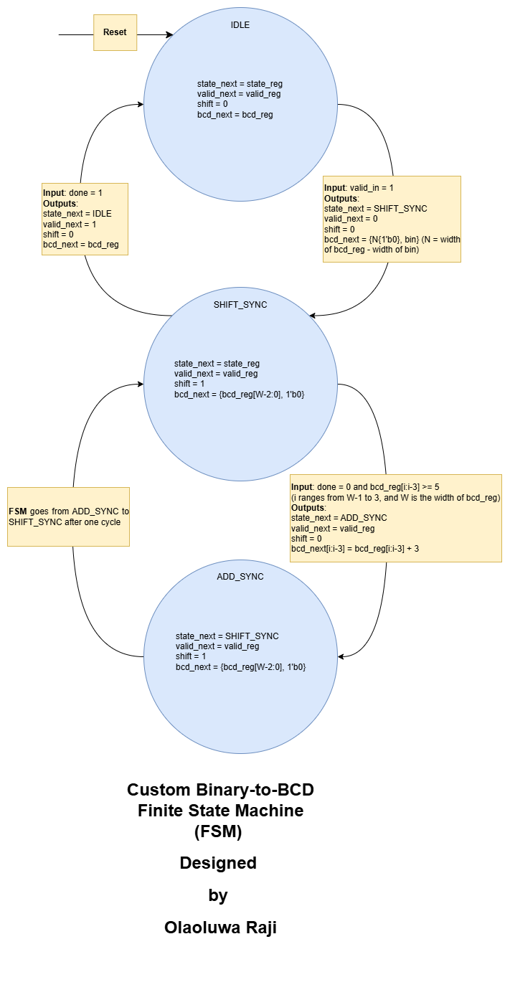
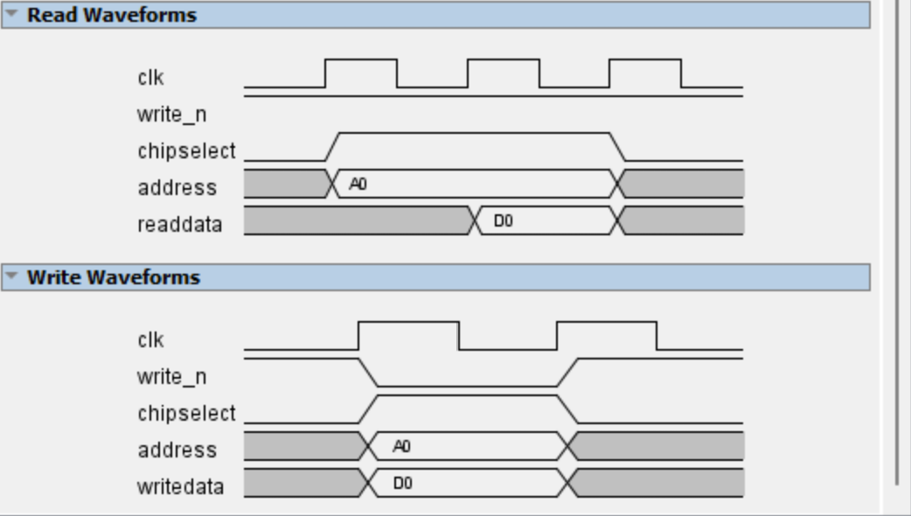

# Hardware-software co-design for custom Bin2BCD converter

In this project, the hardware and software for a custom avalon-bus-compliant binary-to-bcd memory-mapped peripheral ([bin2bcd_mm](./rtl/bin2bcd_mm.sv)) are designed, implemented, tested, and validated on a Terasic DE1-SoC board. The custom [bin2bcd](./rtl/bin2bcd.sv) IP is generic and can easily be ported to another FPGA/SoC board. This design is completely polling based. There is no support for interrupts. 

## Project File Structure

```
.
├── README.md
├── constraints
│   ├── DE1_SOC.qsf
│   └── DE1_SOC.sdc
├── create_project.bat
├── create_project.tcl
├── images
│   ├── avalon_bus_timing.png
│   ├── bin2bcd_fsm.png
│   ├── bin2bcd_mm.png
│   └── bin2bcd_mm_overview.png
├── ip
│   ├── bin2bcd_mm_periph_hw.tcl
│   └── bin2bcd_soc.qsys
├── rtl
│   ├── bin2bcd.sv
│   ├── bin2bcd_mm.sv
│   ├── bin2bcd_soc_top.sv
│   ├── counter.sv
│   └── pkg.sv
├── software
│   ├── Makefile
│   ├── README.md
│   ├── bin2bcd_soc.c
│   └── hps_0.h
└── tb
    ├── README.md
    ├── bin2bcd_mm_tb.sv
    ├── bin2bcd_tb.sv
    ├── counter_tb.sv
    ├── run_bin2bcd_mm_tb.bat
    ├── run_bin2bcd_tb.bat
    ├── run_counter_tb.bat
    └── scripts
        ├── bin2bcd_mm_tb.do
        ├── bin2bcd_tb.do
        ├── bin2bcd_tb.py
        └── counter_tb.do
```

## Script-based Project Generation  

For Windows users:

You can generate the Quartus project from the [create_project.tcl](create_project.tcl) by running the following command in Windows PowerShell:  
`cmd.exe /c 'create_project.bat'`   
The generated project can be found in the `build/` directory created from running the [create_project.bat](create_project.bat) batch file.     

## 1. Hardware Design

### 1.1 Overview
In order to facilitate two-way communication between a hard processor and custom IP which resides in the FPGA fabric of an SoC, we need to leverage the SoC manufacturer's supported on-chip bus protocols. The Terasic board uses an Altera Cyclone V SoC which contains a hard processor (HPS) capable of communicating with other on-chip components using the AXI protocol. In this design, the `bin2bcd_mm` peripheral is implemented on the FPGA side of the Altera SoC and it understands the Avalon protocol. The Intel Platform Designer tool is required to generate the interconnect logic that translates the AXI signals from the HPS to the Avalon signals the `bin2bcd_mm` peripheral understands. At the end of the day, we want the processor to send binary data to the `bin2bcd` IP and receive BCD data from it. The processor will run a simple userspace C application on top of the Linux kernel to communicate with the custom memory-mapped peripheral. 

### 1.2 Block Diagram

<p align="center">
    
</p>   

### 1.3 Peripheral Architecture
<p align="center">
    
</p>  

### 1.4 State Diagram: bin2bcd IP
 
<p align="center">
    
</p> 

### 1.5 Avalon Bus Timing Diagrams

<p align="center">
    
</p> 

## 2 Programmer's Model

### 2.1 Registers
1. Status Register (SR)  
2. Control Register (CR)  
3. Input Data Register (IDR)  
4. Output Data 1 Register (ODR1)  
5. Output Data 2 Register (ODR2)   

| Register | Offset | Access | Description
| :---: | :---: | :---: | --- 
| Status | 0x00 | R | Provides information about the peripheral's state to the HPS/software.  Bit 0 `(BUSY)` is set when a binary-to-bcd conversion is ongoing and cleared if not. The `BUSY` bit must be cleared before the software sends data to the `Input Data Register (IDR)`. Bit 1 `(DONE)` is set when a conversion is completed. The `DONE` bit must be set before the software can read valid BCD data. The `BUSY` and `DONE` bits are set/cleared by hardware and are both read-only. The remaining bits in this register are reserved and set to 0 by hardware.    
| Control | 0x04 | R/W | Configures the peripheral. Bit 0 `(EN)` enables or disables software-peripheral communication. The `EN` bit is set/cleared by software and is a read/write bit. The remaining bits in this register are reserved and set to 0 by hardware.  
| Input Data | 0x08 | R/W | Holds the input binary data required for the binary-to-bcd conversion process. All bits in this register can be read and written to by software.  
| Output Data 1 | 0x0C | R | Holds the lower 32 bits of the output BCD data from the binary-to-bcd conversion process. This register is set/cleared by hardware. All bits in this register are read-only to software.  
| Output Data 2 | 0x10 | R | Holds the upper 32 bits of the output BCD data from the binary-to-bcd conversion process. This register is set/cleared by hardware. All bits in this register are read-only to software.  

### 2.2 How the software should access data from the peripheral 
- Enable the peripheral by setting the `EN` bit in the **Control Register**
- Load the **Input Data Register**  
- Wait for `DONE` bit to be set  
- Read the **Output Data Registers**  

## 3 Simulation

The scripts for automating the verification of the various components of the hardware design can be found in the [tb](./tb/) directory. Kindly take a look at the [README](./tb/README.md) for instructions on how to run the scripts.  

## 4 Demo

1. [Project creation and loading of bitstream to the FPGA side](https://drive.google.com/file/d/1OF4pmlEAcyAq7BAfGhvuPe2xpSpRgrvb/view?usp=drive_link)  
2. [Compiling the application software for the processor side of the SoC](https://drive.google.com/file/d/1D4a7GGgPEaIwRkJbKOGmL9ELUluUNKsm/view?usp=drive_link)    
3. [Running the application on the HPS through PuTTY](https://drive.google.com/file/d/1CLedsHOIqoFGUix8jytnJpoJRCk1CxoZ/view?usp=drive_link)  

## Useful Resources

1. [Altera community forum: How to use Tcl script to generate Qsys system](https://community.altera.com/discussions/quartus-prime/how-to-use-tcl-script-to-generate-qsys-system-inside-quartus/328964)  